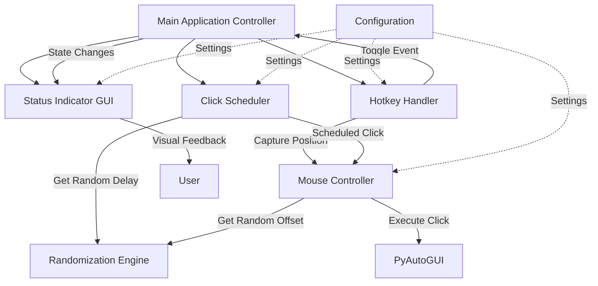
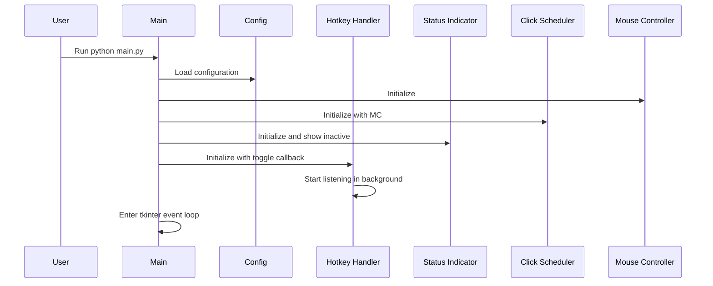
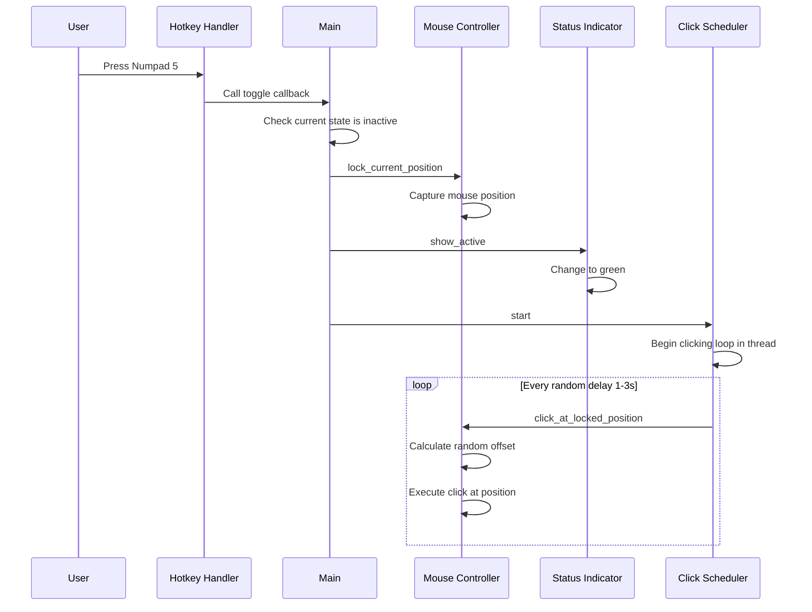
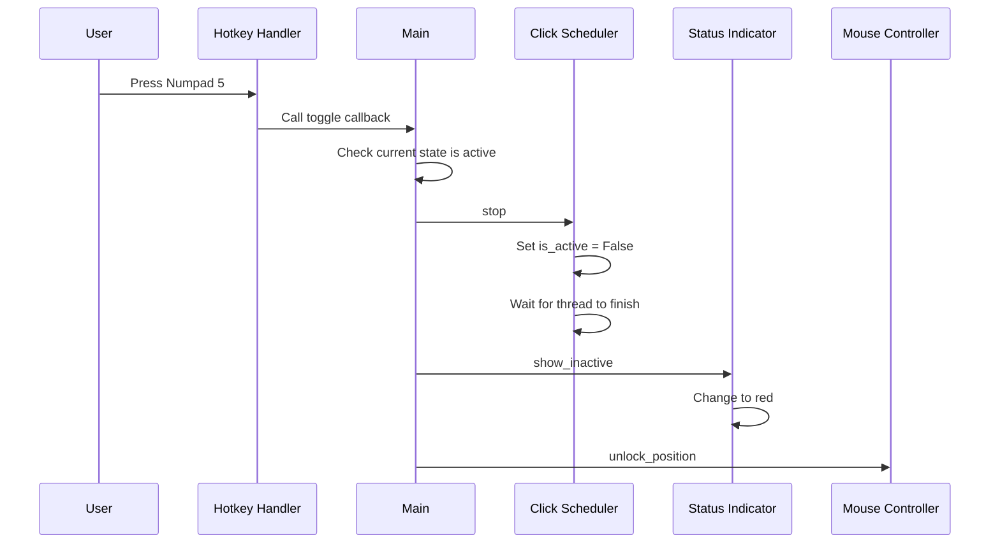
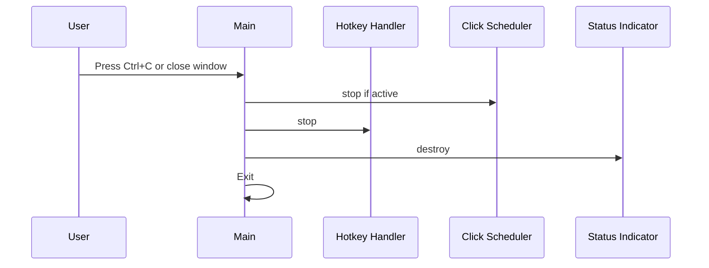

# ClickClick - Technical Architecture Document

## Table of Contents
1. [Overview](#overview)
2. [System Architecture](#system-architecture)
3. [Core Components](#core-components)
4. [Data Flow](#data-flow)
5. [Technology Stack Rationale](#technology-stack-rationale)
6. [File Structure](#file-structure)
7. [Implementation Guidelines](#implementation-guidelines)
8. [Cross-Platform Considerations](#cross-platform-considerations)
9. [Extension Points](#extension-points)

---

## Overview

ClickClick is a Python-based autoclicker application designed with modularity and extensibility as core principles. The MVP focuses on delivering a minimal but complete clicking automation solution with visual feedback through a GUI overlay indicator.

### Design Goals
- **Modularity**: Each component has a single, well-defined responsibility
- **Extensibility**: Easy to add new features without major refactoring
- **Cross-platform**: Support Windows, macOS, and Linux
- **Minimal footprint**: Low resource usage, small visual presence
- **User-friendly**: Clear visual feedback, simple controls

---

## System Architecture

### High-Level Architecture Diagram



### Architecture Layers

**Layer 1: Application Control**
- Main application orchestrator
- State management (active/inactive)
- Component lifecycle management

**Layer 2: Business Logic**
- Click scheduling and timing
- Position locking and offset calculation
- Hotkey event processing

**Layer 3: I/O & System Interaction**
- Mouse control via PyAutoGUI
- Keyboard listening via pynput
- GUI rendering via tkinter

**Layer 4: Configuration**
- Centralized configuration constants
- Easy customization point for future GUI settings

---

## Core Components

### 1. Main Application Controller (`main.py`)

**Responsibility**: Application lifecycle and component orchestration

**Key Functions**:
```python
def main():
    # Initialize all components
    # Setup signal handlers for graceful exit
    # Start GUI event loop
    # Coordinate between components
```

**State Management**:
- `is_active`: Boolean flag for clicking state
- `locked_position`: Tuple (x, y) or None
- `running`: Application running state

**Interactions**:
- Creates and initializes all other components
- Handles graceful shutdown on Ctrl+C
- Coordinates state changes across components

---

### 2. Configuration Module (`config.py`)

**Responsibility**: Centralized configuration constants

**Configuration Parameters**:
```python
# Hotkey Configuration
TOGGLE_HOTKEY = 'num_5'  # Numpad 5

# Click Timing Configuration
MIN_CLICK_DELAY = 1.0  # seconds
MAX_CLICK_DELAY = 3.0  # seconds

# Position Randomization Configuration
POSITION_OFFSET_RANGE = 3  # ±3 pixels on both X and Y

# Visual Indicator Configuration
INDICATOR_SIZE = 30  # pixels (diameter of circle)
INDICATOR_POSITION = 'top-right'  # Options: top-right, top-left, bottom-right, bottom-left
INDICATOR_COLOR_ACTIVE = '#00FF00'  # Green
INDICATOR_COLOR_INACTIVE = '#FF0000'  # Red
INDICATOR_OPACITY = 0.7  # 0.0 to 1.0

# Debug Configuration
CONSOLE_OUTPUT_ENABLED = False  # Set to True for debugging
```

**Design Principle**: All magic numbers and strings in one place for easy modification.

---

### 3. Hotkey Handler (`hotkey_handler.py`)

**Responsibility**: Listen for keyboard events and trigger state changes

**Key Classes**:
```python
class HotkeyHandler:
    def __init__(self, toggle_callback):
        # Store callback function
        # Initialize pynput listener
        
    def start(self):
        # Start keyboard listener in background thread
        
    def stop(self):
        # Stop listener and cleanup
        
    def _on_key_press(self, key):
        # Check if pressed key matches configured hotkey
        # Call toggle_callback if match
```

**Technology Choice**: `pynput.keyboard`
- Cross-platform support
- Simple API for key listening
- Non-blocking operation
- Reliable hotkey detection

**Threading Model**: Runs in separate thread to avoid blocking main application

---

### 4. Mouse Controller (`mouse_controller.py`)

**Responsibility**: Execute mouse clicks with position locking and randomization

**Key Classes**:
```python
class MouseController:
    def __init__(self):
        self.locked_position = None
        
    def lock_current_position(self):
        # Capture current mouse position using PyAutoGUI
        # Store in self.locked_position
        
    def unlock_position(self):
        # Clear locked position
        
    def click_at_locked_position(self):
        # Calculate randomized offset
        # Click at locked_position + offset
        # Handle errors gracefully (silent failure)
        
    def _get_random_offset(self):
        # Return (offset_x, offset_y) within configured range
```

**Technology Choice**: `PyAutoGUI`
- Cross-platform mouse control
- Simple API: `pyautogui.click(x, y)`
- Reliable and well-maintained
- `pyautogui.position()` for position capture

**Error Handling**: 
- Try-except blocks around all PyAutoGUI calls
- Silent failures (no error messages to user)
- Logs failures if console output enabled

---

### 5. Click Scheduler (`click_scheduler.py`)

**Responsibility**: Manage click timing and coordination

**Key Classes**:
```python
class ClickScheduler:
    def __init__(self, mouse_controller, status_callback):
        self.mouse_controller = mouse_controller
        self.is_active = False
        self.thread = None
        
    def start(self):
        # Set is_active to True
        # Start background thread for clicking loop
        
    def stop(self):
        # Set is_active to False
        # Wait for thread to finish
        
    def _clicking_loop(self):
        # While is_active:
        #   - Wait random delay
        #   - Execute click via mouse_controller
        #   - Optional: call status_callback
```

**Threading Model**: Separate thread for non-blocking operation

**Timing Logic**:
```python
import random
import time

delay = random.uniform(MIN_CLICK_DELAY, MAX_CLICK_DELAY)
time.sleep(delay)
```

**Design Pattern**: Producer-Consumer pattern where scheduler produces click commands

---

### 6. Status Indicator GUI (`status_indicator.py`)

**Responsibility**: Display visual status overlay on screen

**Key Classes**:
```python
class StatusIndicator:
    def __init__(self):
        # Create tkinter window
        # Configure as overlay (always on top, no decorations)
        # Position in corner
        # Create circular canvas drawing
        
    def show_active(self):
        # Change color to green
        
    def show_inactive(self):
        # Change color to red
        
    def destroy(self):
        # Close window and cleanup
```

**Technology Choice**: `tkinter`
- Built-in with Python (no extra dependency)
- Sufficient for simple overlay
- Cross-platform

**GUI Configuration**:
- **Window Properties**:
  - `overrideredirect(True)` - Remove window decorations
  - `attributes('-topmost', True)` - Always on top
  - `attributes('-alpha', 0.7)` - Transparency
  - `attributes('-transparentcolor', 'white')` - Transparent background (Windows)
  
- **Canvas Drawing**:
  - 30x30 pixel canvas
  - Oval shape for circle
  - Fill color changes based on state

- **Positioning Algorithm**:
  ```python
  screen_width = root.winfo_screenwidth()
  screen_height = root.winfo_screenheight()
  
  if position == 'top-right':
      x = screen_width - INDICATOR_SIZE - 10
      y = 10
  elif position == 'top-left':
      x = 10
      y = 10
  # ... etc
  ```

**Event Loop Integration**: Runs in main thread using tkinter's event loop

---

## Data Flow

### Application Startup Flow



### Click Activation Flow



### Click Deactivation Flow



### Application Shutdown Flow



---

## Technology Stack Rationale

### PyAutoGUI
**Purpose**: Mouse control and clicking

**Why PyAutoGUI**:
- ✅ Cross-platform (Windows, macOS, Linux)
- ✅ Simple, intuitive API
- ✅ Well-documented and maintained
- ✅ Widely used (proven reliability)
- ✅ Built-in safety features (fail-safes)

**Alternatives Considered**:
- `pynput.mouse`: Good for listening, less ideal for control
- `pywinauto`: Windows-only
- `mouse` library: Less mature

**API Usage**:
```python
import pyautogui

# Get current position
x, y = pyautogui.position()

# Click at position
pyautogui.click(x, y)
```

---

### pynput
**Purpose**: Keyboard hotkey listening

**Why pynput**:
- ✅ Cross-platform keyboard/mouse listening
- ✅ Non-blocking operation
- ✅ Reliable key detection
- ✅ Active maintenance
- ✅ Good documentation

**Alternatives Considered**:
- `keyboard` library: Requires sudo on Linux, installation issues
- `tkinter` key bindings: Requires window focus
- `PyHook3`: Windows-only, outdated

**API Usage**:
```python
from pynput import keyboard

def on_press(key):
    try:
        if key == keyboard.Key.num_5:
            # Handle hotkey
    except AttributeError:
        pass

listener = keyboard.Listener(on_press=on_press)
listener.start()
```

---

### tkinter
**Purpose**: Minimal GUI overlay for status indicator

**Why tkinter**:
- ✅ Built-in with Python (no extra dependency)
- ✅ Cross-platform
- ✅ Sufficient for simple overlay
- ✅ Well-documented
- ✅ Lightweight

**Alternatives Considered**:
- `PyQt5`/`PySide6`: Overkill for simple indicator, large dependency
- `pygame`: Not designed for GUI overlays
- `wxPython`: Larger dependency, more complex

**API Usage**:
```python
import tkinter as tk

root = tk.Tk()
root.overrideredirect(True)
root.attributes('-topmost', True)
canvas = tk.Canvas(root, width=30, height=30)
circle = canvas.create_oval(5, 5, 25, 25, fill='red')
```

---

### random (built-in)
**Purpose**: Randomization for delays and offsets

**Why random**:
- ✅ Built-in Python module
- ✅ Sufficient for our needs
- ✅ `random.uniform()` for float ranges
- ✅ `random.randint()` for integer ranges

---

## File Structure

```
clickclick/
│
├── README.md                      # Project overview and user documentation
├── ARCHITECTURE.md                # This file - technical architecture
├── requirements.txt               # Python package dependencies
│
├── src/                