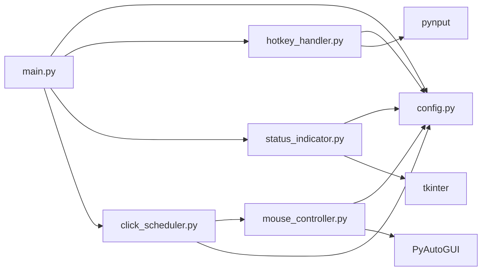

# ClickClick - Implementation Plan for Python Specialist

## Overview
This document provides a step-by-step implementation plan for building the ClickClick autoclicker application based on the architecture defined in [`ARCHITECTURE.md`](ARCHITECTURE.md).

## Prerequisites
- Python 3.8 or higher installed
- Understanding of the architecture in ARCHITECTURE.md
- Familiarity with threading in Python
- Basic tkinter knowledge

## Implementation Order

### Phase 1: Project Setup
1. **Create project structure**
   ```
   clickclick/
   ├── src/
   │   ├── __init__.py
   │   ├── config.py
   │   ├── mouse_controller.py
   │   ├── hotkey_handler.py
   │   ├── click_scheduler.py
   │   ├── status_indicator.py
   │   └── main.py
   └── requirements.txt
   ```

2. **Create requirements.txt**
   ```
   pyautogui>=0.9.53
   pynput>=1.7.6
   ```

3. **Create src/__init__.py** (empty file for package)

---

### Phase 2: Configuration Module
**File**: [`src/config.py`](src/config.py)

**Implementation Steps**:
1. Define all configuration constants as specified in ARCHITECTURE.md
2. Include comments explaining each configuration option
3. Ensure all magic numbers are eliminated from other modules

**Validation**:
- All constants are properly typed
- Comments are clear and helpful
- No hardcoded values in other modules

---

### Phase 3: Mouse Controller Module
**File**: [`src/mouse_controller.py`](src/mouse_controller.py)

**Implementation Steps**:
1. Create `MouseController` class
2. Implement `lock_current_position()` method using `pyautogui.position()`
3. Implement `unlock_position()` method
4. Implement `_get_random_offset()` private method using `random.randint()`
5. Implement `click_at_locked_position()` method:
   - Calculate offset
   - Use `pyautogui.click(x, y)`
   - Wrap in try-except for silent failure
6. Add optional console logging based on config

**Validation**:
- Test position locking captures correct coordinates
- Test random offsets are within ±3 pixels
- Test clicks execute at correct positions
- Verify silent error handling works

---

### Phase 4: Status Indicator GUI Module
**File**: [`src/status_indicator.py`](src/status_indicator.py)

**Implementation Steps**:
1. Create `StatusIndicator` class
2. In `__init__`:
   - Create tkinter root window
   - Set window properties (overrideredirect, topmost, alpha)
   - Calculate position based on config
   - Create Canvas with circular drawing
   - Set initial color to red (inactive)
3. Implement `show_active()` to change circle to green
4. Implement `show_inactive()` to change circle to red
5. Implement `destroy()` for cleanup
6. Handle cross-platform transparency differences

**Platform-Specific Notes**:
- Windows: Use `attributes('-transparentcolor', 'white')`
- macOS: Limited transparency support
- Linux: May vary by window manager

**Validation**:
- Indicator appears in correct corner
- Circle is 30x30 pixels
- Color changes work correctly
- Window stays on top
- Transparency works (platform-dependent)

---

### Phase 5: Click Scheduler Module
**File**: [`src/click_scheduler.py`](src/click_scheduler.py)

**Implementation Steps**:
1. Create `ClickScheduler` class
2. In `__init__`:
   - Store mouse_controller reference
   - Initialize is_active flag to False
   - Initialize thread variable to None
3. Implement `start()` method:
   - Set is_active to True
   - Create and start thread running `_clicking_loop()`
4. Implement `stop()` method:
   - Set is_active to False
   - Join thread to wait for completion
5. Implement `_clicking_loop()` private method:
   - Loop while is_active
   - Generate random delay using `random.uniform()`
   - Sleep for delay
   - Call mouse_controller.click_at_locked_position()
   - Handle thread-safe exit

**Threading Considerations**:
- Use `threading.Thread`
- Set daemon=True for clean exit
- Ensure thread-safe access to is_active flag
- Proper cleanup on stop

**Validation**:
- Thread starts and stops cleanly
- Random delays are between 1-3 seconds
- Clicks execute during loop
- Thread exits properly when stopped

---

### Phase 6: Hotkey Handler Module
**File**: [`src/hotkey_handler.py`](src/hotkey_handler.py)

**Implementation Steps**:
1. Create `HotkeyHandler` class
2. In `__init__`:
   - Store toggle_callback reference
   - Initialize pynput keyboard listener
3. Implement `start()` method:
   - Start keyboard listener in non-blocking mode
4. Implement `stop()` method:
   - Stop listener and cleanup
5. Implement `_on_press()` callback:
   - Check if key matches configured hotkey (Key.num_5 for numpad 5)
   - Call toggle_callback if match
   - Handle AttributeError for special keys

**Key Detection**:
- Use `pynput.keyboard.Key` for special keys
- Map 'num_5' config to `Key.num_5`
- Handle both KeyCode and Key types

**Validation**:
- Numpad 5 press is detected reliably
- Callback is triggered on correct key
- Listener runs without blocking
- Clean shutdown on stop

---

### Phase 7: Main Application Controller
**File**: [`src/main.py`](src/main.py)

**Implementation Steps**:
1. Import all required modules
2. Create `ClickClickApp` class:
   - Initialize all components in `__init__`
   - Store application state (is_active, locked_position)
3. Implement `toggle_clicking()` callback:
   - Check current state
   - If inactive: lock position, start scheduler, show active indicator
   - If active: stop scheduler, unlock position, show inactive indicator
4. Implement `run()` method:
   - Start hotkey handler
   - Enter tkinter main loop
5. Implement `cleanup()` method:
   - Stop scheduler if active
   - Stop hotkey handler
   - Destroy indicator
6. Add signal handler for Ctrl+C:
   - Use `signal.signal(signal.SIGINT, handler)`
   - Call cleanup on exit
7. Add `if __name__ == '__main__':` block:
   - Create app instance
   - Call app.run()

**State Management**:
- Track is_active boolean
- Coordinate state across all components
- Ensure clean transitions5

**Error Handling**:
- Graceful exit on Ctrl+C
- Clean up all resour5ces
- Handle exceptions silently (per requirements)

**Validation**:
- Application starts successfully
- Toggle works correctly5
- All components coordinate properly
- Clean shutdown on exit
- Ctrl+C handling works

---

## Phase 8: Testing & Validation

### Manual Testing Checklist
- [ ] Application starts without errors
- [ ] Red indicator appears in corner on start
- [ ] Numpad 5 toggles from inactive to active
- [ ] Indicator changes from red to green
- [ ] Mouse position is locked when activated
- [ ] Clicks occur at locked position with random timing
- [ ] Random delays are between 1-3 seconds
- [ ] Position offsets are small (±3 pixels)
- [ ] Numpad 5 toggles back to inactive
- [ ] Indicator changes from green to red
- [ ] Clicking stops when deactivated
- [ ] Ctrl+C exits cleanly
- [ ] No error messages appear during normal operation

### Cross-Platform Testing
- [ ] Test on Windows
- [ ] Test on macOS (if available)
- [ ] Test on Linux (if available)
- [ ] Verify indicator positioning on each platform
- [ ] Verify transparency on each platform

### Edge Case Testing
- [ ] Rapid toggle presses (toggle quickly multiple times)
- [ ] Move mouse while clicking (should stay at locked position)
- [ ] Click near screen edges (ensure offsets don't go off-screen)
- [ ] Long running session (verify no memory leaks)
- [ ] Exit while actively clicking

---

## Phase 9: Documentation Completion

1. **Update README.md**:
   - Fill in actual installation commands
   - Add complete usage instructions
   - Add troubleshooting section if needed

2. **Create CHANGELOG.md**:
   - Document v1.0.0 MVP release

3. **Add docstrings**:
   - Add comprehensive docstrings to all classes and methods
   - Follow Google or NumPy docstring format

---

## Implementation Tips

### Debugging
- Set `CONSOLE_OUTPUT_ENABLED = True` in config during development
- Add print statements in key methods
- Use `try-except` with print for catching silent errors

### Common Pitfalls
1. **Tkinter threading**: tkinter must run in main thread
2. **pynput numpad keys**: Use `Key.num_5`, not string "5"
3. **PyAutoGUI fail-safe**: Moving mouse to corner stops it (can disable if needed)
4. **Thread cleanup**: Always join threads before exit
5. **Window focus**: tkinter indicator should not steal focus

### Code Quality
- Keep files under 300 lines (per Python specialist guidelines)
- Use type hints where appropriate
- Follow PEP 8 style guidelines
- Add comments for complex logic
- Use meaningful variable names

---

## Module Dependencies



---

## Success Criteria

The MVP is complete when:
1. ✅ All modules are implemented according to architecture
2. ✅ All manual tests pass
3. ✅ Application runs without errors
4. ✅ Code is clean and well-documented
5. ✅ README.md is updated with actual instructions
6. ✅ Application is ready for user testing

---

## Next Steps After MVP

Once the MVP is validated and working:
1. Gather user feedback
2. Identify most valuable features for v1.1
3. Refactor based on lessons learned
4. Begin implementing extended features from README.md

---

**Document Version**: 1.0  
**Last Updated**: 2025-11-10  
**Status**: Ready for Implementation