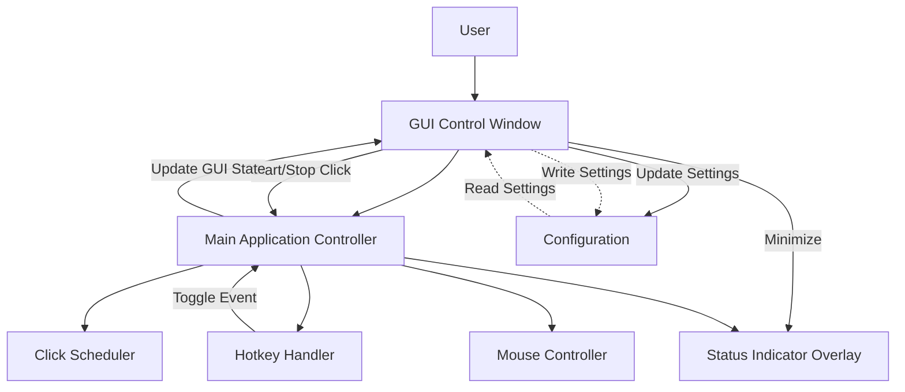
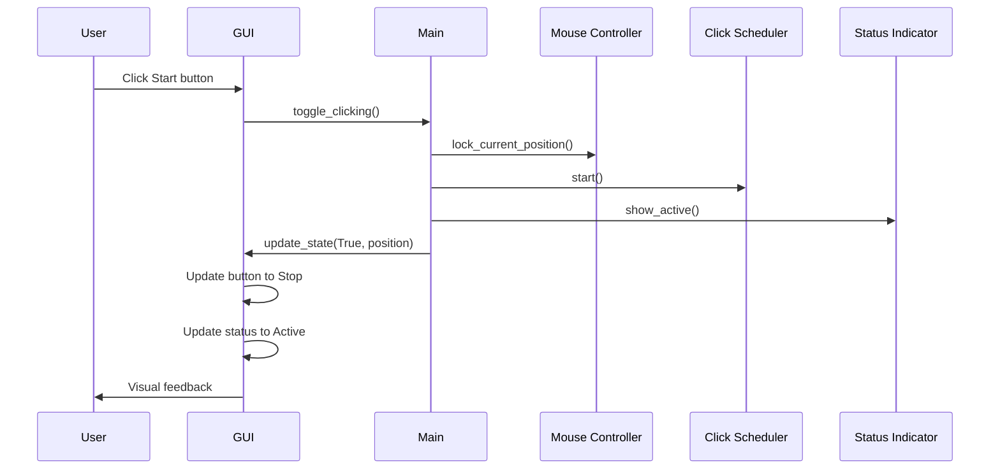
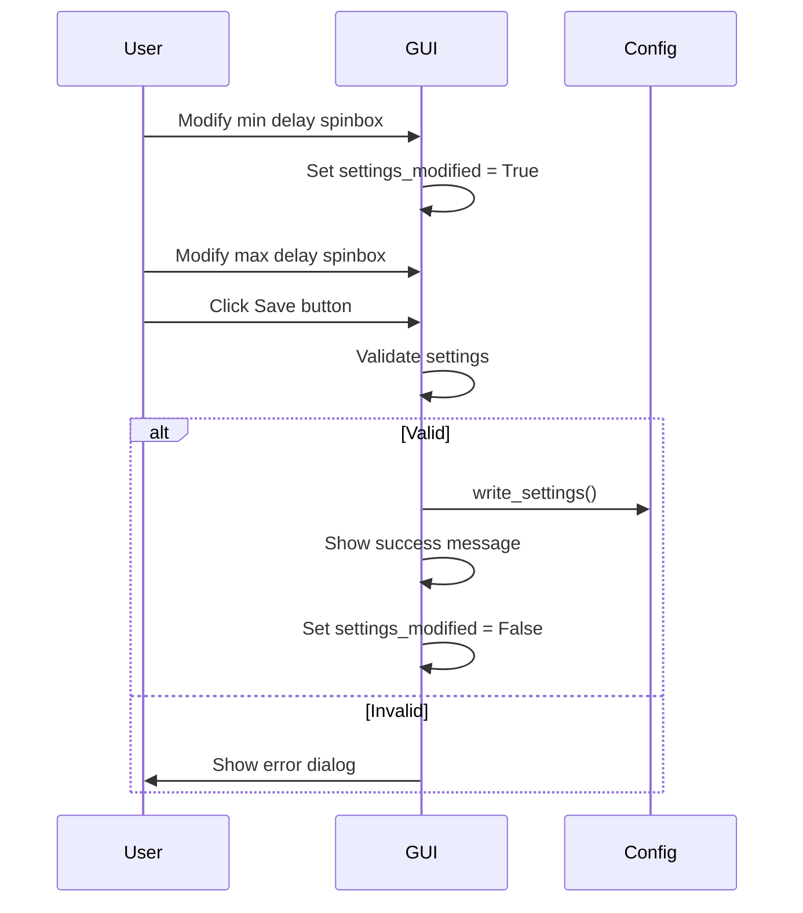
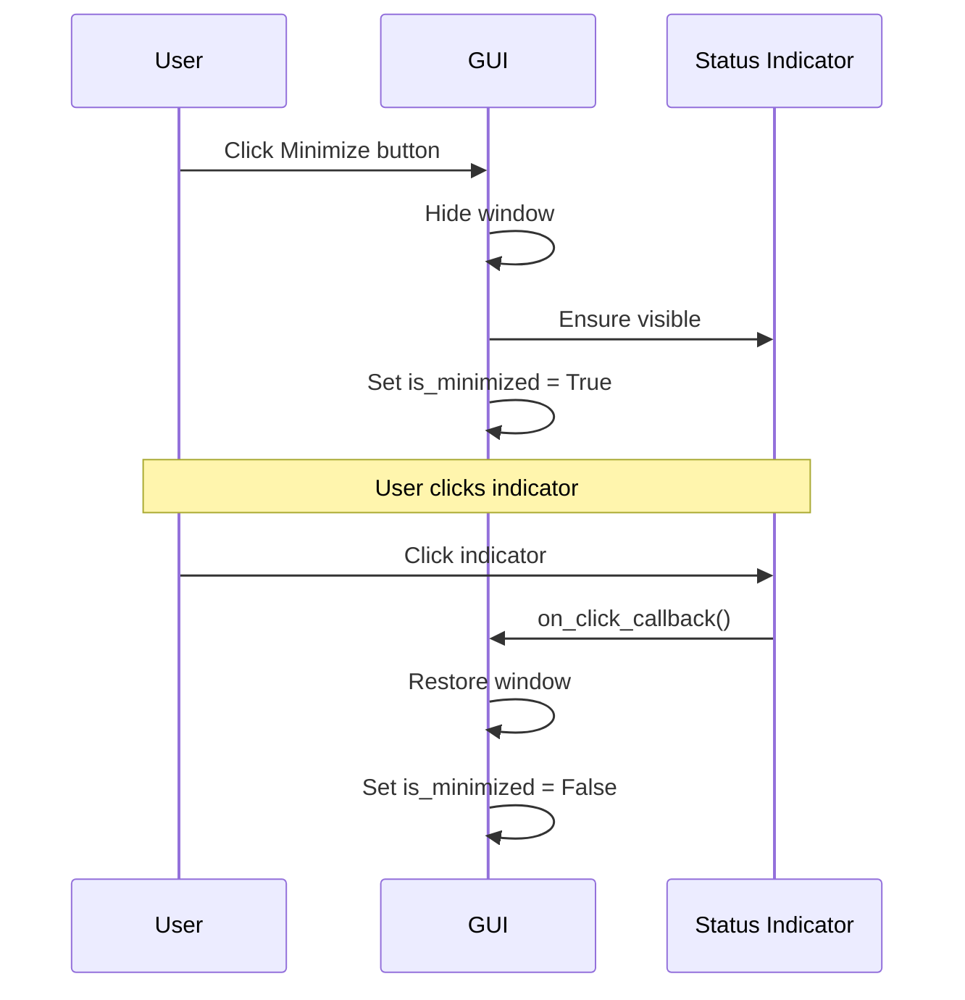
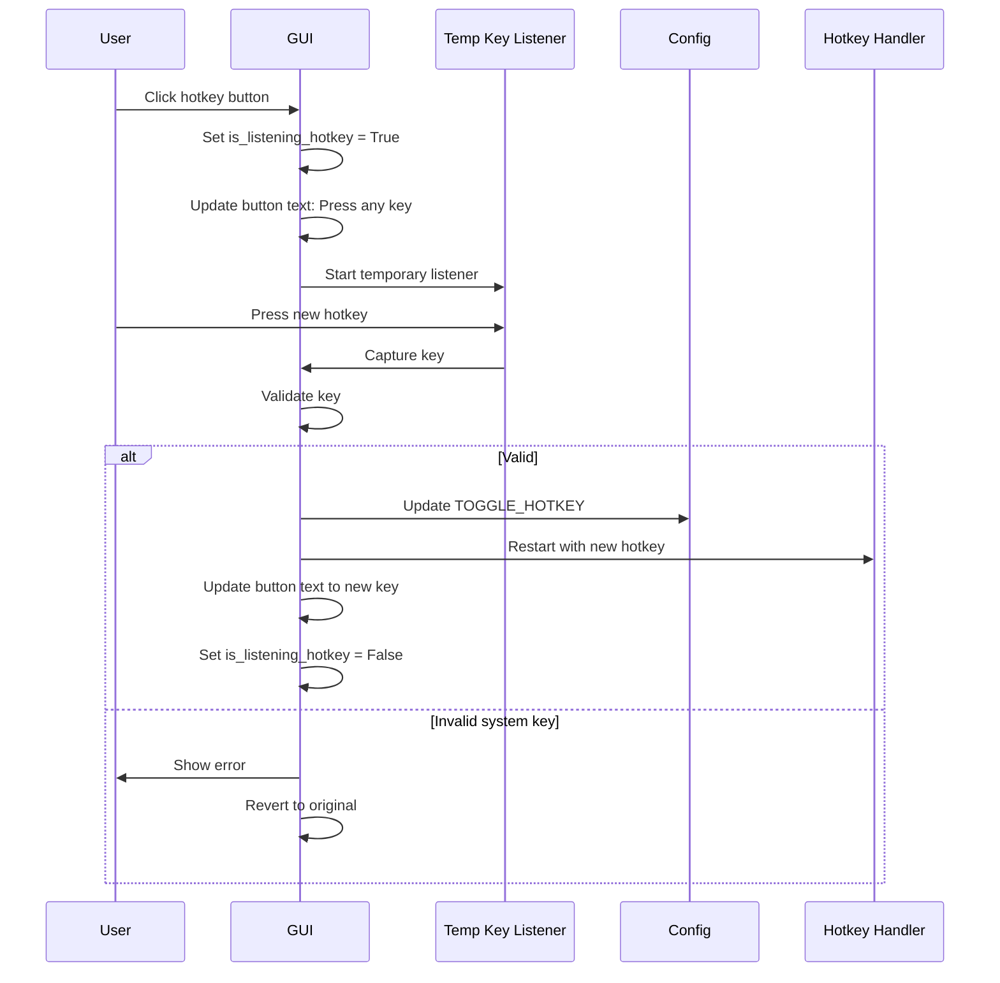

# ClickClick GUI Design Document

## Table of Contents
1. [Overview](#overview)
2. [Design Goals](#design-goals)
3. [GUI Architecture](#gui-architecture)
4. [Main Control Window Specification](#main-control-window-specification)
5. [Widget Specifications](#widget-specifications)
6. [Layout Structure](#layout-structure)
7. [Integration with Backend](#integration-with-backend)
8. [State Management](#state-management)
9. [Threading Considerations](#threading-considerations)
10. [User Interaction Flows](#user-interaction-flows)
11. [Implementation Plan](#implementation-plan)

---

## Overview

This document specifies the GUI design for the ClickClick auto-clicker application. The GUI will provide a user-friendly interface for configuring and controlling the auto-clicker through a main control window that can minimize to the existing status indicator overlay.

### Current State
The application currently has:
- Minimal status indicator overlay (30x30 red/green circle)
- Hotkey-based control (Numpad 5)
- Configuration through [`config.py`](../src/config.py) file only

### Proposed Enhancement
Add a comprehensive GUI control window with:
- Start/Stop button for manual control
- Click duration/timing configuration
- Position offset controls
- Hotkey customization
- Window minimize to status indicator

---

## Design Goals

1. **User-Friendly**: Intuitive controls that don't require editing configuration files
2. **Non-Intrusive**: Can minimize to the existing status indicator
3. **Real-Time Feedback**: Clear visual indication of current state and settings
4. **Maintainable**: Clean separation between GUI and business logic
5. **Responsive**: GUI remains responsive during clicking operations
6. **Cross-Platform**: Works consistently on Windows, macOS, and Linux

---

## GUI Architecture

### High-Level Architecture



### Component Responsibilities

**GUI Control Window** ([`src/gui_window.py`](../src/gui_window.py) - new file):
- Display and manage all GUI controls
- Handle user input from widgets
- Communicate with main application controller
- Manage window show/hide/minimize states

**Main Application Controller** ([`src/main.py`](../src/main.py) - modified):
- Instantiate GUI window
- Coordinate between GUI and backend components
- Handle state transitions triggered by GUI or hotkeys
- Manage application lifecycle

**Status Indicator** ([`src/status_indicator.py`](../src/status_indicator.py) - modified):
- Continue to show red/green overlay
- Add click handler to restore main window from minimized state

---

## Main Control Window Specification

### Window Properties

```python
# Window Configuration
WINDOW_TITLE = "ClickClick Auto-Clicker"
WINDOW_WIDTH = 400
WINDOW_HEIGHT = 500
WINDOW_RESIZABLE = False
WINDOW_ICON = None  # Optional: Add icon in future

# Window Behavior
ALWAYS_ON_TOP = False  # Allow user to toggle
START_MINIMIZED = False  # Optional configuration
MINIMIZE_TO_TRAY = False  # Future enhancement
```

### Visual Mockup Description

```
┌─────────────────────────────────────────┐
│  ClickClick Auto-Clicker           [_][□][×] │
├─────────────────────────────────────────┤
│                                         │
│  ┌─────────────────────────────────┐  │
│  │         Status Section          │  │
│  │                                 │  │
│  │  Status: ● Inactive             │  │
│  │  Position: Not Locked           │  │
│  │                                 │  │
│  │  [    Start Auto-Clicker    ]  │  │
│  │                                 │  │
│  └─────────────────────────────────┘  │
│                                         │
│  ┌─────────────────────────────────┐  │
│  │     Click Timing Settings       │  │
│  │                                 │  │
│  │  Min Delay (sec): [1.0  ] ◄►   │  │
│  │  Max Delay (sec): [3.0  ] ◄►   │  │
│  │                                 │  │
│  └─────────────────────────────────┘  │
│                                         │
│  ┌─────────────────────────────────┐  │
│  │   Position Offset Settings      │  │
│  │                                 │  │
│  │  Offset Range (±px): [3  ] ◄►  │  │
│  │                                 │  │
│  │  Preview: ±3 pixels on X & Y   │  │
│  │                                 │  │
│  └─────────────────────────────────┘  │
│                                         │
│  ┌─────────────────────────────────┐  │
│  │      Hotkey Configuration       │  │
│  │                                 │  │
│  │  Toggle Hotkey: [ Numpad 5  ]  │  │
│  │  (Click to change)              │  │
│  │                                 │  │
│  └─────────────────────────────────┘  │
│                                         │
│  ┌─────────────────────────────────┐  │
│  │      Advanced Options           │  │
│  │                                 │  │
│  │  ☑ Show Status Indicator        │  │
│  │  ☐ Always On Top                │  │
│  │  ☐ Console Debug Output         │  │
│  │                                 │  │
│  └─────────────────────────────────┘  │
│                                         │
│  [  Minimize to Indicator  ] [ Save ]  │
│                                         │
└─────────────────────────────────────────┘
```

---

## Widget Specifications

### 1. Status Section

**Purpose**: Display current application state and provide main control

**Widgets**:

```python
# Status Label
tk.Label(text="Status: ")
status_indicator = tk.Label(text="● Inactive", fg="red")

# Position Label
position_label = tk.Label(text="Position: Not Locked")

# Main Control Button
start_stop_button = tk.Button(
    text="Start Auto-Clicker",
    command=self.toggle_clicking,
    width=30,
    height=2,
    font=("Arial", 12, "bold"),
    bg="#4CAF50",  # Green when stopped
    fg="white"
)
```

**Behavior**:
- Status indicator shows colored circle (●) matching indicator overlay
- Position label updates when position is locked
- Button text changes: "Start Auto-Clicker" ↔ "Stop Auto-Clicker"
- Button color changes: Green (#4CAF50) ↔ Red (#f44336)

---

### 2. Click Timing Settings

**Purpose**: Configure delay between clicks

**Widgets**:

```python
# Min Delay
min_delay_label = tk.Label(text="Min Delay (sec):")
min_delay_spinbox = tk.Spinbox(
    from_=0.1,
    to=10.0,
    increment=0.1,
    width=10,
    format="%.1f"
)

# Max Delay
max_delay_label = tk.Label(text="Max Delay (sec):")
max_delay_spinbox = tk.Spinbox(
    from_=0.1,
    to=10.0,
    increment=0.1,
    width=10,
    format="%.1f"
)
```

**Validation**:
- Min delay must be ≥ 0.1 seconds
- Max delay must be > min delay
- Show error message if validation fails

---

### 3. Position Offset Settings

**Purpose**: Configure randomization range for click positions

**Widgets**:

```python
# Offset Range
offset_label = tk.Label(text="Offset Range (±px):")
offset_spinbox = tk.Spinbox(
    from_=0,
    to=50,
    increment=1,
    width=10
)

# Preview Label
offset_preview = tk.Label(
    text="Preview: ±3 pixels on X & Y",
    font=("Arial", 9, "italic"),
    fg="gray"
)
```

**Behavior**:
- Updates preview text dynamically as value changes
- Range: 0-50 pixels
- 0 means no randomization (click at exact position)

---

### 4. Hotkey Configuration

**Purpose**: Allow users to customize the toggle hotkey

**Widgets**:

```python
# Hotkey Display/Button
hotkey_label = tk.Label(text="Toggle Hotkey:")
hotkey_button = tk.Button(
    text="Numpad 5",
    command=self.open_hotkey_dialog,
    width=20
)
help_label = tk.Label(
    text="(Click to change)",
    font=("Arial", 8, "italic"),
    fg="gray"
)
```

**Behavior**:
- Click button to enter "listening mode"
- Display "Press any key..." while listening
- Capture next keypress and set as new hotkey
- Validate that hotkey is not a system key
- Update configuration and restart hotkey handler

---

### 5. Advanced Options

**Purpose**: Additional settings and preferences

**Widgets**:

```python
# Checkboxes
show_indicator_var = tk.BooleanVar(value=True)
show_indicator_check = tk.Checkbutton(
    text="Show Status Indicator",
    variable=show_indicator_var,
    command=self.toggle_indicator_visibility
)

always_on_top_var = tk.BooleanVar(value=False)
always_on_top_check = tk.Checkbutton(
    text="Always On Top",
    variable=always_on_top_var,
    command=self.toggle_always_on_top
)

console_debug_var = tk.BooleanVar(value=False)
console_debug_check = tk.Checkbutton(
    text="Console Debug Output",
    variable=console_debug_var,
    command=self.toggle_console_output
)
```

**Behavior**:
- Changes apply immediately
- Show indicator: Show/hide the status overlay
- Always on top: Keep GUI window above other windows
- Console debug: Enable/disable console logging

---

### 6. Action Buttons

**Purpose**: Window management and settings persistence

**Widgets**:

```python
# Minimize Button
minimize_button = tk.Button(
    text="Minimize to Indicator",
    command=self.minimize_to_indicator,
    width=20
)

# Save Button
save_button = tk.Button(
    text="Save",
    command=self.save_settings,
    width=10,
    bg="#2196F3",
    fg="white"
)
```

**Behavior**:
- Minimize: Hide window, show only status indicator
- Save: Write current settings to [`config.py`](../src/config.py) or config file
- Auto-save on window close (optional)

---

## Layout Structure

### Frame Hierarchy

```python
root (tk.Tk)
├── main_frame (tk.Frame)
│   ├── status_frame (tk.LabelFrame)
│   │   ├── status_display_frame
│   │   └── control_button
│   ├── timing_frame (tk.LabelFrame)
│   │   ├── min_delay_row
│   │   └── max_delay_row
│   ├── offset_frame (tk.LabelFrame)
│   │   ├── offset_control_row
│   │   └── preview_label
│   ├── hotkey_frame (tk.LabelFrame)
│   │   ├── hotkey_display
│   │   └── help_text
│   ├── advanced_frame (tk.LabelFrame)
│   │   ├── checkbox_1
│   │   ├── checkbox_2
│   │   └── checkbox_3
│   └── button_frame (tk.Frame)
│       ├── minimize_button
│       └── save_button
```

### Layout Code Structure

```python
# Main frame with padding
main_frame = tk.Frame(root, padx=20, pady=20)
main_frame.pack(fill=tk.BOTH, expand=True)

# Status section
status_frame = tk.LabelFrame(main_frame, text="Status Section", padx=10, pady=10)
status_frame.pack(fill=tk.X, pady=(0, 10))

# Timing section
timing_frame = tk.LabelFrame(main_frame, text="Click Timing Settings", padx=10, pady=10)
timing_frame.pack(fill=tk.X, pady=(0, 10))

# Offset section
offset_frame = tk.LabelFrame(main_frame, text="Position Offset Settings", padx=10, pady=10)
offset_frame.pack(fill=tk.X, pady=(0, 10))

# Hotkey section
hotkey_frame = tk.LabelFrame(main_frame, text="Hotkey Configuration", padx=10, pady=10)
hotkey_frame.pack(fill=tk.X, pady=(0, 10))

# Advanced section
advanced_frame = tk.LabelFrame(main_frame, text="Advanced Options", padx=10, pady=10)
advanced_frame.pack(fill=tk.X, pady=(0, 10))

# Button section
button_frame = tk.Frame(main_frame)
button_frame.pack(fill=tk.X, pady=(10, 0))
```

---

## Integration with Backend

### Modified Main Application Controller

**File**: [`src/main.py`](../src/main.py)

**Changes Required**:

```python
from gui_window import GUIWindow

class ClickClickApp:
    def __init__(self):
        # Existing initialization
        self.is_active = False
        self.locked_position = None
        self.running = True
        
        # Backend components
        self.mouse_controller = MouseController()
        self.click_scheduler = ClickScheduler(self.mouse_controller)
        self.status_indicator = StatusIndicator()
        self.hotkey_handler = HotkeyHandler(self.toggle_clicking)
        
        # NEW: GUI window
        self.gui_window = GUIWindow(self)
        
    def toggle_clicking(self):
        """Modified to update GUI state"""
        # Existing toggle logic...
        
        # NEW: Update GUI state
        self.gui_window.update_state(self.is_active, self.locked_position)
        
    def run(self):
        """Modified to show GUI window"""
        # Show GUI window
        self.gui_window.show()
        
        # Start hotkey handler
        self.hotkey_handler.start()
        
        # Enter main loop (GUI window manages this now)
        self.gui_window.root.mainloop()
```

### New GUI Window Class

**File**: [`src/gui_window.py`](../src/gui_window.py) (new)

**Class Structure**:

```python
class GUIWindow:
    def __init__(self, app_controller):
        """
        Initialize GUI window.
        
        Args:
            app_controller: Reference to main ClickClickApp instance
        """
        self.app = app_controller
        self.root = tk.Tk()
        self.is_minimized = False
        
        # Initialize all widgets
        self._create_widgets()
        self._load_settings()
        
    def show(self):
        """Display the GUI window"""
        
    def hide(self):
        """Hide the GUI window"""
        
    def minimize_to_indicator(self):
        """Minimize window and show only status indicator"""
        
    def restore_from_indicator(self):
        """Restore window from minimized state"""
        
    def update_state(self, is_active, locked_position):
        """Update GUI to reflect current application state"""
        
    def toggle_clicking(self):
        """Handle start/stop button click"""
        
    def save_settings(self):
        """Save current settings to configuration"""
        
    def _create_widgets(self):
        """Create all GUI widgets"""
        
    def _load_settings(self):
        """Load settings from configuration"""
        
    def _validate_timing(self):
        """Validate min/max delay values"""
```

### Modified Status Indicator

**File**: [`src/status_indicator.py`](../src/status_indicator.py)

**Changes Required**:

```python


class StatusIndicator:
    def __init__(self, on_click_callback=None):
        """
        Initialize status indicator with optional click callback.
        
        Args:
            on_click_callback: Function to call when indicator is clicked
        """
        self.on_click_callback = on_click_callback
        # ... existing code ...
        
    def _create_canvas(self):
        """Create canvas with click binding"""
        # ... existing canvas creation ...
        
        # NEW: Bind click event to restore window
        if self.on_click_callback:
            self.canvas.bind("<Button-1>", lambda e: self.on_click_callback())
```

**Integration Points**:

1. **GUI → Main Controller**:
   - `app.toggle_clicking()` - Start/stop clicking
   - `app.update_config(settings_dict)` - Update configuration
   - `app.get_status()` - Get current state

2. **Main Controller → GUI**:
   - `gui.update_state(is_active, position)` - Sync GUI with state
   - `gui.show_error(message)` - Display error messages
   - `gui.show_success(message)` - Display success messages

3. **GUI → Configuration**:
   - Read from [`config.py`](../src/config.py) on startup
   - Write to config file on save (consider JSON/INI for user-editable settings)

---

## State Management

### Application State Variables

The GUI must track and reflect the following state:

```python
# Application State (managed by main controller)
is_active: bool              # Is auto-clicker running?
locked_position: Tuple[int, int] or None  # Locked mouse position
running: bool                # Is application running?

# GUI State (managed by GUI window)
is_minimized: bool          # Is window minimized?
settings_modified: bool     # Have settings changed since last save?
is_listening_hotkey: bool   # Is hotkey capture active?

# Configuration State (loaded from config)
min_delay: float
max_delay: float
offset_range: int
toggle_hotkey: str
show_indicator: bool
always_on_top: bool
console_debug: bool
```

### State Synchronization

**GUI must update when**:
1. User clicks Start/Stop button
2. Hotkey pressed (external trigger)
3. Settings changed via GUI controls
4. Window minimized/restored
5. Application started/stopped

**Synchronization Pattern**:

```python
def update_state(self, is_active, locked_position):
    """
    Called by main controller to sync GUI with application state.
    Must be thread-safe using tkinter's after() method.
    """
    def _update():
        # Update status indicator
        if is_active:
            self.status_label.config(text="● Active", fg="green")
            self.control_button.config(
                text="Stop Auto-Clicker",
                bg="#f44336"  # Red
            )
        else:
            self.status_label.config(text="● Inactive", fg="red")
            self.control_button.config(
                text="Start Auto-Clicker",
                bg="#4CAF50"  # Green
            )
        
        # Update position label
        if locked_position:
            self.position_label.config(
                text=f"Position: ({locked_position[0]}, {locked_position[1]})"
            )
        else:
            self.position_label.config(text="Position: Not Locked")
    
    # Thread-safe update
    self.root.after(0, _update)
```

---

## Threading Considerations

### Thread Safety Requirements

**Problem**: The GUI (tkinter) runs in the main thread, but:
- Click scheduler runs in background thread
- Hotkey handler runs in background thread
- GUI updates from these threads will crash the application

**Solution**: Use tkinter's `after()` method for cross-thread communication

### Thread-Safe Update Pattern

```python
class GUIWindow:
    def update_from_background_thread(self, data):
        """
        Safe method to update GUI from background threads.
        
        Args:
            data: Data to update GUI with
        """
        # Schedule update in main thread
        self.root.after(0, lambda: self._do_update(data))
        
    def _do_update(self, data):
        """
        Actual update logic (runs in main thread).
        
        Args:
            data: Data to update GUI with
        """
        # Update widgets here - safe because in main thread
        pass
```

### Blocking Operations

**Avoid blocking the GUI thread**:

```python
# BAD - Blocks GUI
def save_settings(self):
    time.sleep(5)  # Simulating slow operation
    write_config()

# GOOD - Non-blocking
def save_settings(self):
    # Show "saving..." message
    self.status_bar.config(text="Saving...")
    
    # Run in background thread
    threading.Thread(
        target=self._save_settings_background,
        daemon=True
    ).start()
    
def _save_settings_background(self):
    write_config()
    # Update GUI in main thread
    self.root.after(0, lambda: self.status_bar.config(text="Saved!"))
```

### Widget Access Rules

1. **All widget creation** must happen in main thread
2. **All widget updates** must happen in main thread
3. **Use `after()`** for cross-thread updates
4. **Never call GUI methods** directly from background threads

---

## User Interaction Flows

### Flow 1: Start Auto-Clicker via GUI



### Flow 2: Change Settings and Save



### Flow 3: Minimize and Restore



### Flow 4: Hotkey Configuration



---

## Implementation Plan

### Phase 1: Create GUI Window Module (Priority: High)

**File**: [`src/gui_window.py`](../src/gui_window.py)

**Tasks**:
1. Create `GUIWindow` class with `__init__` method
2. Implement `_create_widgets()` to build all GUI components
3. Implement basic layout structure with frames
4. Add status section with start/stop button
5. Add timing settings section with spinboxes
6. Add offset settings section
7. Add hotkey configuration section
8. Add advanced options checkboxes
9. Add action buttons (minimize, save)

**Validation**:
- Window displays with all widgets
- Layout matches mockup
- Window is resizable/non-resizable as specified

---

### Phase 2: Implement State Management (Priority: High)

**Tasks**:
1. Implement `update_state()` method for thread-safe updates
2. Implement `_load_settings()` to read from config
3. Implement `save_settings()` to write to config
4. Add validation methods for settings
5. Implement settings change tracking

**Validation**:
- Settings load correctly on startup
- Settings save correctly
- Validation prevents invalid input
- State updates work from background threads

---

### Phase 3: Integrate with Main Controller (Priority: High)

**File**: [`src/main.py`](../src/main.py)

**Tasks**:
1. Import `GUIWindow` class
2. Instantiate GUI in `__init__`
3. Modify `toggle_clicking()` to update GUI
4. Modify `run()` to show GUI window
5. Pass GUI update callback to status indicator
6. Handle window close event

**Validation**:
- Application starts with GUI visible
- Hotkey still works and updates GUI
- Status indicator click restores window
- Application closes cleanly

---

### Phase 4: Implement Window Management (Priority: Medium)

**Tasks**:
1. Implement `minimize_to_indicator()` method
2. Implement `restore_from_indicator()` method
3. Modify status indicator to call restore callback
4. Implement "always on top" toggle
5. Handle window close vs minimize behavior

**Validation**:
- Minimize hides window but keeps app running
- Click indicator restores window
- Always on top works correctly
- Close button behavior is intuitive

---

### Phase 5: Implement Advanced Features (Priority: Medium)

**Tasks**:
1. Implement hotkey capture dialog/mode
2. Implement settings validation with error messages
3. Add offset preview updates
4. Implement console debug toggle
5. Add status bar for feedback messages

**Validation**:
- Hotkey capture works reliably
- Error messages are clear and helpful
- Preview updates in real-time
- Debug toggle affects console output

---

### Phase 6: Polish and Error Handling (Priority: Low)

**Tasks**:
1. Add tooltips to controls
2. Implement unsaved changes warning
3. Add keyboard shortcuts (Enter to save, Esc to cancel)
4. Improve error message presentation
5. Add help/about dialog (optional)

**Validation**:
- User experience is smooth
- No unexpected crashes
- Error messages are user-friendly
- Keyboard shortcuts work

---

## Configuration File Strategy

### Current: Python Module ([`config.py`](../src/config.py))

**Pros**:
- Simple to import and use
- Type-safe constants
- No parsing required

**Cons**:
- Not user-editable without Python knowledge
- Requires restart to apply changes
- Can't be easily modified by GUI

### Proposed: JSON Configuration File

**File**: `config.json`

```json
{
  "hotkey": "num_5",
  "click_timing": {
    "min_delay": 1.0,
    "max_delay": 3.0
  },
  "position": {
    "offset_range": 3
  },
  "indicator": {
    "size": 30,
    "position": "top-right",
    "color_active": "#00FF00",
    "color_inactive": "#FF0000",
    "opacity": 0.7
  },
  "gui": {
    "always_on_top": false,
    "start_minimized": false
  },
  "debug": {
    "console_output": false
  }
}
```

**Implementation**:

```python
# config.py becomes a loader module
import json
from pathlib import Path

CONFIG_FILE = Path(__file__).parent.parent / "config.json"

def load_config():
    """Load configuration from JSON file"""
    with open(CONFIG_FILE, 'r') as f:
        return json.load(f)

def save_config(config_dict):
    """Save configuration to JSON file"""
    with open(CONFIG_FILE, 'w') as f:
        json.dump(config_dict, f, indent=2)

# Load config as module-level constants
_config = load_config()
TOGGLE_HOTKEY = _config['hotkey']
MIN_CLICK_DELAY = _config['click_timing']['min_delay']
# ... etc
```

---

## Testing Checklist

### Manual Testing

- [ ] Window opens at correct size and position
- [ ] All widgets are visible and labeled correctly
- [ ] Start button starts clicking
- [ ] Stop button stops clicking
- [ ] Status updates match indicator overlay
- [ ] Min/max delay spinboxes accept valid values
- [ ] Min/max delay validation prevents invalid inputs
- [ ] Offset range spinbox works correctly
- [ ] Offset preview updates in real-time
- [ ] Hotkey capture works reliably
- [ ] Settings save and persist 
across restarts
- [ ] Minimize to indicator works
- [ ] Click indicator restores window
- [ ] Always on top works
- [ ] Console debug toggle affects output
- [ ] Show indicator toggle works
- [ ] Window can be closed cleanly
- [ ] Hotkey still works after GUI changes settings
- [ ] Multiple rapid toggles don't crash
- [ ] Settings persist after application restart

### Cross-Platform Testing

- [ ] Test on Windows 10/11
- [ ] Test on macOS (if available)
- [ ] Test on Linux (if available)
- [ ] Verify window positioning on different screen resolutions
- [ ] Verify tkinter widget appearance on each platform

---

## Future Enhancements

### Post-MVP Features

1. **Click Duration Control**
   - Add timer to auto-stop after specified duration
   - Display countdown while clicking
   - Add pause/resume functionality

2. **Click Profiles**
   - Save/load multiple configuration profiles
   - Quick switch between profiles
   - Profile management interface

3. **Advanced Statistics**
   - Track total clicks performed
   - Display clicks per minute
   - Show uptime/session duration
   - Click history graph

4. **System Tray Integration**
   - Minimize to system tray instead of indicator
   - Right-click tray menu
   - Tray notifications for events

5. **Multiple Click Positions**
   - Define multiple positions
   - Sequential clicking pattern
   - Position management interface

6. **Click Type Selection**
   - Left, right, middle click
   - Single, double, triple click
   - Drag operations

---

## Technical Notes

### Tkinter Limitations

1. **Limited styling**: Use ttk for better appearance
2. **No native tooltips**: Implement custom tooltip class if needed
3. **Window transparency**: Platform-dependent, test carefully
4. **File dialogs**: Use `tkinter.filedialog` for save/load

### Performance Considerations

1. **GUI updates**: Batch updates to reduce redraws
2. **Settings validation**: Validate on change, not on save
3. **Thread synchronization**: Minimize `after()` calls
4. **Memory management**: Clean up resources on close

### Security Considerations

1. **Configuration files**: Validate loaded JSON to prevent injection
2. **Hotkey capture**: Sanitize captured keys
3. **File permissions**: Use appropriate permissions for config file
4. **Error messages**: Don't expose sensitive paths or data

---

## Summary

This GUI design document provides comprehensive specifications for implementing a user-friendly control window for the ClickClick auto-clicker application. The design:

1. **Maintains backward compatibility** with existing status indicator
2. **Provides intuitive controls** for all configuration options
3. **Ensures thread safety** for GUI updates from background threads
4. **Supports minimize to indicator** for non-intrusive operation
5. **Enables runtime configuration** without editing code
6. **Follows cross-platform best practices** for tkinter

### Key Design Decisions

| Decision | Rationale |
|----------|-----------|
| Use tkinter | Built-in, no extra dependencies, sufficient for MVP |
| Separate GUI module | Clean separation of concerns, maintainable |
| JSON config file | User-editable, GUI-writable, structured |
| Thread-safe updates | Prevent crashes from background thread updates |
| LabelFrame sections | Clear visual organization of related controls |
| Non-resizable window | Consistent layout across platforms |

### Files to Create/Modify

**New Files**:
- [`src/gui_window.py`](../src/gui_window.py) - Main GUI window class
- `config.json` - User-editable configuration file

**Modified Files**:
- [`src/main.py`](../src/main.py) - Integrate GUI window
- [`src/status_indicator.py`](../src/status_indicator.py) - Add click callback
- [`src/config.py`](../src/config.py) - Change to config loader

**Documentation**:
- This file: [`docs/GUI_DESIGN.md`](../docs/GUI_DESIGN.md)
- Update [`README.md`](../README.md) with GUI usage instructions
- Update [`ARCHITECTURE.md`](../ARCHITECTURE.md) with GUI component

---

## Appendix: Code Templates

### Template 1: Basic GUIWindow Structure

```python
"""
GUI window module for ClickClick auto-clicker application.
"""

import tkinter as tk
from tkinter import ttk, messagebox
import threading
from typing import Optional, Tuple, Callable

from config import load_config, save_config


class GUIWindow:
    """Main GUI control window for ClickClick application."""
    
    def __init__(self, app_controller):
        """
        Initialize GUI window.
        
        Args:
            app_controller: Reference to ClickClickApp instance
        """
        self.app = app_controller
        self.root = tk.Tk()
        self.root.title("ClickClick Auto-Clicker")
        self.root.geometry("400x500")
        self.root.resizable(False, False)
        
        # State variables
        self.is_minimized = False
        self.settings_modified = False
        
        # Widget references
        self.status_label = None
        self.position_label = None
        self.control_button = None
        self.min_delay_var = tk.DoubleVar()
        self.max_delay_var = tk.DoubleVar()
        self.offset_var = tk.IntVar()
        self.show_indicator_var = tk.BooleanVar()
        self.always_on_top_var = tk.BooleanVar()
        self.console_debug_var = tk.BooleanVar()
        
        # Build GUI
        self._create_widgets()
        self._load_settings()
        
        # Handle window close
        self.root.protocol("WM_DELETE_WINDOW", self._on_close)
    
    def _create_widgets(self):
        """Create all GUI widgets."""
        # TODO: Implement widget creation
        pass
    
    def _load_settings(self):
        """Load settings from configuration."""
        # TODO: Implement settings loading
        pass
    
    def save_settings(self):
        """Save current settings to configuration."""
        # TODO: Implement settings saving
        pass
    
    def update_state(self, is_active: bool, locked_position: Optional[Tuple[int, int]]):
        """
        Update GUI to reflect current application state.
        Thread-safe method using after().
        
        Args:
            is_active: Whether auto-clicker is running
            locked_position: Locked mouse position or None
        """
        def _update():
            # TODO: Update status display
            # TODO: Update button appearance
            # TODO: Update position label
            pass
        
        self.root.after(0, _update)
    
    def show(self):
        """Display the GUI window."""
        self.root.deiconify()
        self.is_minimized = False
    
    def hide(self):
        """Hide the GUI window."""
        self.root.withdraw()
    
    def minimize_to_indicator(self):
        """Minimize window to status indicator."""
        self.hide()
        self.is_minimized = True
    
    def restore_from_indicator(self):
        """Restore window from minimized state."""
        self.show()
    
    def _on_close(self):
        """Handle window close event."""
        if self.settings_modified:
            # TODO: Ask to save changes
            pass
        self.app.cleanup()
```

### Template 2: Thread-Safe Update Helper

```python
def create_thread_safe_updater(root):
    """
    Create a thread-safe update helper.
    
    Args:
        root: Tkinter root window
        
    Returns:
        Function that can be called from any thread
    """
    def update(callback, *args, **kwargs):
        """
        Schedule callback to run in main thread.
        
        Args:
            callback: Function to call
            *args: Positional arguments
            **kwargs: Keyword arguments
        """
        root.after(0, lambda: callback(*args, **kwargs))
    
    return update
```

### Template 3: Settings Validation

```python
def validate_timing_settings(min_delay, max_delay):
    """
    Validate timing settings.
    
    Args:
        min_delay: Minimum delay in seconds
        max_delay: Maximum delay in seconds
        
    Returns:
        Tuple of (is_valid, error_message)
    """
    if min_delay < 0.1:
        return False, "Minimum delay must be at least 0.1 seconds"
    
    if max_delay < 0.1:
        return False, "Maximum delay must be at least 0.1 seconds"
    
    if min_delay >= max_delay:
        return False, "Maximum delay must be greater than minimum delay"
    
    return True, ""
```

---

**Document Version**: 1.0  
**Last Updated**: 2025-11-10  
**Status**: Ready for Implementation  
**Author**: Architecture Team